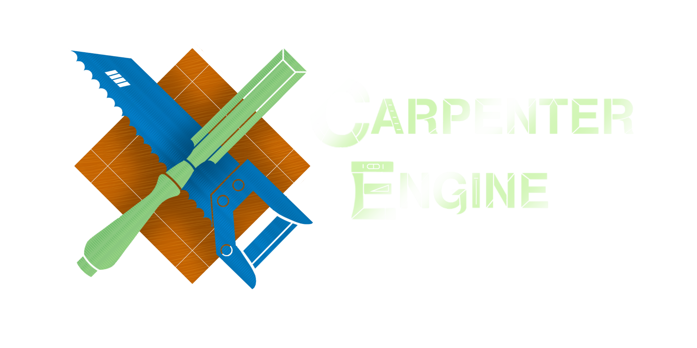

\mainpage

Carpenter Engine is a Modular C++ Game Engine designed to take advantage of
WebAssembly and web browser technology to create flexible web clients. The purpose
of the game engine is primarily to develop 2D and 2.5D games, but the goal is for
the engine to be flexible that you can add any feature possible.

The game engine comes with both the framework to develop games in the game engine,
and a CLI to assist developing the game such as installing compilers and building
the game for you.

# Contributing
Although we will try our hardest to catch and work on issues on our own, we
will gladly look into any feedback you guys offer, and resolve bugs that you may
have discovered on your own. If you wish to contribute to the issues, ensure that
you are creating your own fork and we will manage any pull requests you offer If
we approve the implementation of the feature. Any request or bug report you offer
should be in the Issues section of the repo, and we will take care of it as soon
as we can.

## Requests

Although we will implement primarily what we need, we are always open to requests
and suggestions. we will only ask for the request, and how the game engine will
benefit from this. If we agree that a feature is in our scope, we will put it in
our schedule to implement it and it will be done as soon as we can. 

## Reporting a Bug
If you need to report a bug, ensure you have the following:
- Bug Description
- How to replicate
- Hardware and Browser Specs

The amount of hardware you include is not the biggest concern, we are most
concerned about the browser you are using. We currently maintain primarily for
Chrome/Chromium based browsers only, but we are also looking into supporting
Firefox based browsers too.

# Credits

Lead Project Manager and Developer: [Roberto Selles](https://henderythmix.is-a.dev)

Pull Request Monitoring:
- [*kbph*](https://github.com/kbph05)

Software Contributions:
- [*BigChungus21220*](https://github.com/BigChungus21220) - Testing.hpp

Other:
- [*Blue*](https://github.com/Shenyuanmeigui12) - Carpenter Engine Logo

## Licensing
Carpenter Engine is licensed under the Mozilla Public License 2.0. Any code modified
from the original source code must be made open source and licensed under MPL-2.0.

> Accreditation of Carpenter Engine will be enforced by the Engine in the splash
> Screen. Although not enforced, further credit of MesaGuilde or Carpenter Engine
> will always be appreciated. You may also remove the splash screen credit as long
> as you follow the MPL-2.0 license and requirements.

For further licensing information, please refer to the
[LICENSE](https://github.com/MesaGuildeTeam/Carpenter-Engine/blob/main/LICENSE)
and [NOTICE](https://github.com/MesaGuildeTeam/Carpenter-Engine/blob/main/NOTICE.md)
files.
